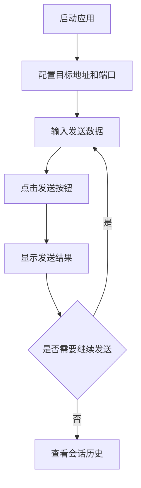
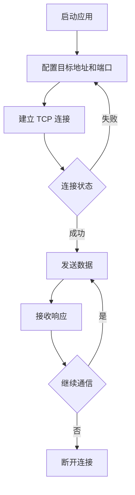

# UDP/TCP 协议测试工具 - 产品需求文档

## 1. 产品概述

网络协议测试工具是一款面向网络工程师、开发者和运维人员的桌面应用程序，用于测试和调试 UDP 和 TCP 协议通信。该工具提供直观的图形界面，支持发送自定义数据包、实时显示通信状态、记录会话历史，帮助用户快速诊断网络连接问题。

## 2. 核心功能

### 2.1 功能模块

#### 2.1.1 UDP 协议测试模块
- **连接配置**：设置目标 IP 地址、端口号、本地端口
- **数据发送**：支持文本和十六进制数据输入
- **实时通信**：显示发送和接收的数据包
- **响应分析**：解析并展示服务器响应内容
- **连接状态**：实时显示 UDP 连接状态

#### 2.1.2 TCP 协议测试模块
- **连接配置**：设置目标 IP 地址、端口号
- **连接管理**：支持建立连接、断开连接
- **数据发送**：支持文本和十六进制数据输入
- **实时通信**：显示发送和接收的数据流
- **响应分析**：解析并展示服务器响应内容
- **连接状态**：实时显示 TCP 连接状态（连接中、已连接、断开）

#### 2.1.3 会话管理
- **历史记录**：自动保存通信会话
- **会话重放**：支持重新发送历史请求
- **数据导出**：导出通信记录为文件
- **会话清空**：一键清空当前会话数据

#### 2.1.4 工具设置
- **编码设置**：支持 UTF-8、GBK、ASCII 等编码
- **显示模式**：文本或十六进制显示切换
- **自动重连**：TCP 连接断开后自动重连选项
- **日志级别**：设置日志详细程度

## 3. 核心流程

### 3.1 UDP 测试流程

### 3.2 TCP 测试流程

## 4. 用户界面设计

### 4.1 设计风格

#### 视觉风格
- **主题**：深色科技风格，营造专业网络工具氛围
- **配色方案**：
  - 主色：#00D9FF（科技蓝）
  - 辅助色：#1A1A2E（深紫黑）
  - 强调色：#00FF88（成功绿）、#FF6B6B（错误红）、#FFD93D（警告黄）
  - 背景色：#0F0F1A（深色背景）、#1A1A2E（卡片背景）
  - 文字色：#FFFFFF（主文字）、#A0A0A0（次要文字）

#### 布局风格
- **整体布局**：左侧导航 + 右侧内容区的分屏设计
- **卡片设计**：圆角卡片，带微妙阴影和边框
- **字体**：JetBrains Mono（数据展示）、Inter（界面文字）

#### 动效设计
- **状态切换**：平滑的颜色过渡动画（200ms）
- **按钮交互**：悬停时微微上浮 + 发光效果
- **数据更新**：新消息淡入动画

### 4.2 页面结构

| 页面 | 模块 | UI 元素 |
|------|------|---------|
| 主界面 | 左侧导航栏 | 协议选择（UDP/TCP）、会话列表、设置入口 |
| UDP 页面 | 连接配置区 | IP 输入框、目标端口、本地端口 |
| UDP 页面 | 数据输入区 | 文本输入框、hex 输入切换、发送按钮 |
| UDP 页面 | 消息显示区 | 消息列表、时间戳、方向指示（发送/接收） |
| TCP 页面 | 连接配置区 | IP 输入框、端口、连接按钮 |
| TCP 页面 | 数据交互区 | 消息输入框、发送按钮、连接状态指示 |
| TCP 页面 | 会话记录区 | 实时消息流、连接状态、时间戳 |
| 设置页面 | 通用设置 | 编码选择、显示模式、日志级别 |

### 4.3 响应式设计

- **桌面优先**：主要针对 1920x1080 和 1366x768 分辨率优化
- **最小窗口**：800x600 像素
- **自适应布局**：窗口缩放时自动调整面板比例

## 5. 技术约束

- **平台支持**：Windows、macOS、Linux
- **Electron 版本**：最新稳定版
- **Vue 版本**：Vue 3.x + Composition API
- **数据格式**：支持文本和十六进制转换
- **网络超时**：默认 5 秒，可配置
