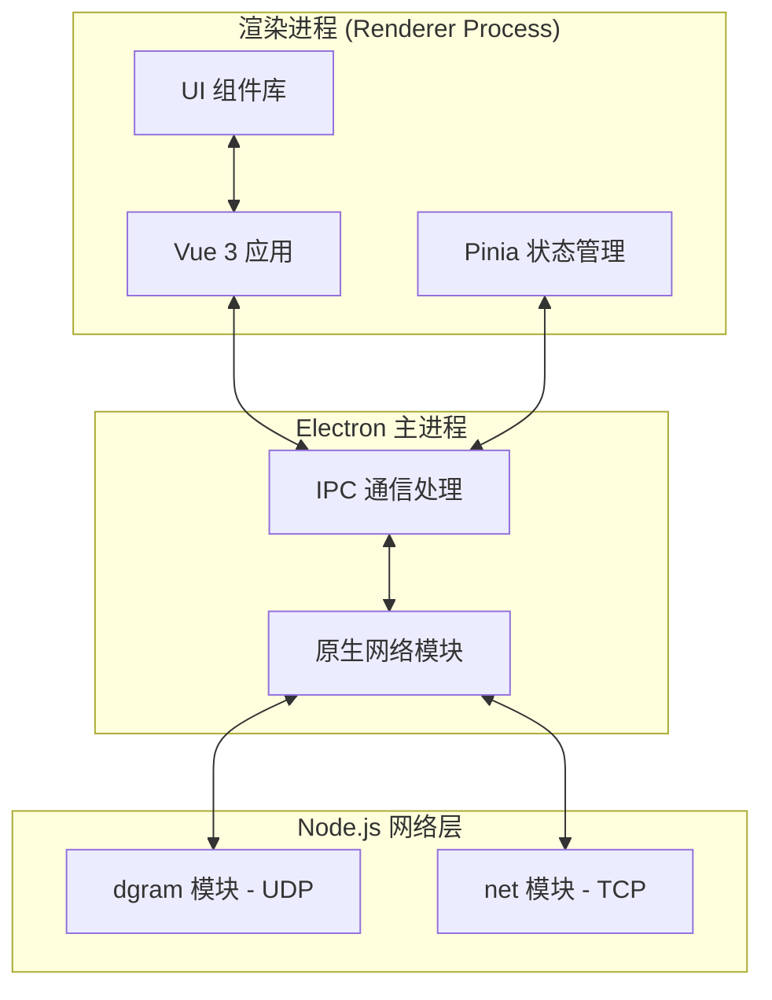
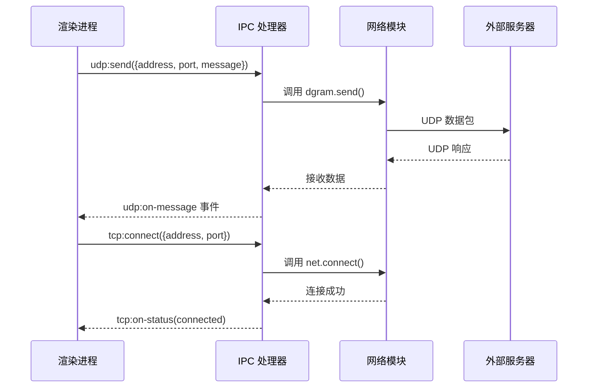

# UDP/TCP 协议测试工具 - 技术架构文档

## 1. 架构设计



## 2. 技术栈

### 2.1 核心框架
- **Electron**: 最新稳定版（v28+）
- **Vue**: 3.4+ (Composition API)
- **Vite**: 5.x (构建工具)
- **TypeScript**: 5.x

### 2.2 状态管理
- **Pinia**: Vue 3 推荐的状态管理库

### 2.3 UI 组件
- **自定义组件**: 使用 Vue 3 + TypeScript 编写
- **样式**: 原生 CSS + CSS Variables

### 2.4 网络通信
- **dgram**: Node.js 内置 UDP 模块
- **net**: Node.js 内置 TCP 模块

## 3. 项目结构

```
udp-tcp-tester/
├── electron/
│   ├── main.ts           # Electron 主进程入口
│   ├── preload.ts        # 预加载脚本
│   └── ipc/
│       └── network.ts    # 网络操作 IPC 处理
├── src/
│   ├── main.ts           # Vue 应用入口
│   ├── App.vue           # 根组件
│   ├── assets/
│   │   └── styles/
│   │       └── main.css  # 全局样式
│   ├── components/
│   │   ├── layout/
│   │   │   ├── Sidebar.vue
│   │   │   └── Header.vue
│   │   ├── udp/
│   │   │   ├── UdpConfig.vue
│   │   │   ├── UdpSender.vue
│   │   │   └── UdpMessages.vue
│   │   └── tcp/
│   │       ├── TcpConfig.vue
│   │       ├── TcpSender.vue
│   │       └── TcpMessages.vue
│   ├── stores/
│   │   ├── udpStore.ts
│   │   └── tcpStore.ts
│   ├── views/
│   │   ├── UdpView.vue
│   │   ├── TcpView.vue
│   │   └── SettingsView.vue
│   └── types/
│       └── index.ts      # TypeScript 类型定义
├── package.json
├── vite.config.ts
├── electron-builder.yml
└── tsconfig.json
```

## 4. IPC 通信定义

### 4.1 UDP 操作

| 方法名 | 参数 | 返回值 | 说明 |
|--------|------|--------|------|
| `udp:create` | `{ port: number }` | `{ success: boolean }` | 创建 UDP socket |
| `udp:send` | `{ address, port, message }` | `{ success: boolean }` | 发送 UDP 数据包 |
| `udp:close` | 无 | `{ success: boolean }` | 关闭 UDP socket |
| `udp:on-message` | 事件 | `{ data, rinfo }` | 接收数据事件 |

### 4.2 TCP 操作

| 方法名 | 参数 | 返回值 | 说明 |
|--------|------|--------|------|
| `tcp:connect` | `{ address, port }` | `{ success: boolean }` | 建立 TCP 连接 |
| `tcp:send` | `{ message }` | `{ success: boolean }` | 发送数据 |
| `tcp:disconnect` | 无 | `{ success: boolean }` | 断开连接 |
| `tcp:on-data` | 事件 | `{ data }` | 接收数据事件 |
| `tcp:on-status` | 事件 | `{ status }` | 状态变化事件 |

## 5. 数据模型

### 5.1 消息类型

```typescript
interface NetworkMessage {
  id: string;
  type: 'send' | 'receive';
  protocol: 'UDP' | 'TCP';
  data: string;
  timestamp: Date;
  address?: string;
  port?: number;
  success: boolean;
  error?: string;
}
```

### 5.2 连接状态

```typescript
type ConnectionStatus = 'disconnected' | 'connecting' | 'connected' | 'error';
```

### 5.3 应用配置

```typescript
interface AppConfig {
  encoding: 'utf-8' | 'gbk' | 'ascii';
  displayMode: 'text' | 'hex';
  autoReconnect: boolean;
  logLevel: 'debug' | 'info' | 'warn' | 'error';
  timeout: number;
}
```

## 6. Electron 主进程架构



## 7. 安全考虑

- **Context Isolation**: 启用上下文隔离
- **Node Integration**: 禁用 Node.js 集成（渲染进程）
- **Preload Scripts**: 通过预加载脚本安全暴露 API
- **Input Validation**: 所有用户输入进行验证和清理

## 8. 构建配置

- **打包工具**: electron-builder
- **目标平台**: Windows (NSIS)、macOS (DMG)、Linux (AppImage)
- **代码签名**: 可选配置
